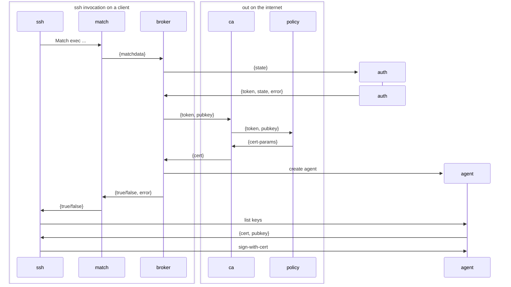

# Epithet makes SSH certificates easy

[](https://github.com/epithet-ssh/epithet/actions) [](https://goreportcard.com/report/github.com/epithet-ssh/epithet) [](https://codeclimate.com/github/brianm/epithet/maintainability)

## Plan for v2

The Epithet Agent is an ssh agent which runs on the endpoint. Rather than exposing a single agent socket, however, it will create a socket on demand for a given outbound connection.

To know if it needs to do it it will need to do something like:

```
Match exec "epithet auth --host %h --port %p --user %r --hash %C"
    IdentityAgent ~/.epithet/sockets/%C
```

The `epithet auth` invocation will do several things:

1. Check to see if the host (`%h`) should be handled by epithet at all, abort early if not
2. See if there is an existing, unexpired, certificate for the targeted user/host
3. If there is an existing cert, set up an identity socket at %C with only that cert
4. If there is not an existing cert, request one, including doing any need authentication, then if receive one, GOTO 3
5. When the certificate expires, delete the socket at %C

Step 5 is kind of questionable, but I think correct. In theory if a given cert if bound to a %C then it should be reusable directly as long as the socket/cert is there. Two catches -- this creates a race condition where it is unexpried when checked but before being used. This is a small window, so honestly is probably solvable by just having a 1-2 second "oh, this cert is going to expire, let's go fetch a new one" before allowing the connection. When the new one is established, just swizzle the cert into the agent on that socket and don't change the socket.

## `epithet auth` details

The `epithet auth` invocation probably needs to receive all the components of `%C` as well as the %C hash itself.
```
%C    Hash of %l%h%p%r%j.

%l    The local hostname, including the domain name.
%h    The remote hostname.
%p    The remote port.
%r    The remote username.
%j    The contents of the ProxyJump option, or the empty string if this option is unset.
```
The `%C` hash can be used as a key to find the specific agent for that "connection", which probably needs to be a map of `connection -> agent` where the agent exposes the ability to find the expiration of the cert it is currently using, the public key it is currently using, and the ability to atomically replace the cert it is using with a new one. The public key needs to be retrievable so that `epithet auth` can go get new certificates to recplace then in the agent in question.

Actually, interestingly, we might be able to use openssh's ssh-agent to do this, and not need to develop our own ssh-agent protocol at all. basically we set up a tree:

`epithet-agent` -> `[ssh-agent]` where it invokes ssh-agent commands on the agent as needed. We can optimize a number of things by keeping track of the certificates they are issued, so we can query the cert (and keys) without spawning a child process. Communication with the agent can be done via [ssh-agent-client-rs](https://github.com/nresare/ssh-agent-client-rs) which seems very fit for purpose.

We should consider destination constraining the target host for these agents. Need to think about abuse vectors if we don't do that.

## Notes


## TODO

- **Implement a less strict netstring parser**: The current auth plugin protocol uses the `markdingo/netstring` library which strictly rejects whitespace between netstrings. This makes debugging auth plugins difficult since developers can't use `println()` for debugging output. We should implement a custom netstring parser that tolerates whitespace (spaces, tabs, `\n`, `\r`) between netstrings while still being strict about the netstring format itself. This would maintain protocol compatibility while significantly improving developer experience when writing auth plugins.
