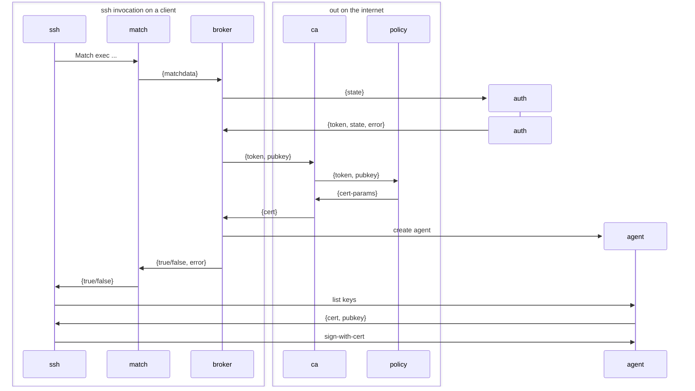

# Epithet makes SSH certificates easy

[](https://github.com/epithet-ssh/epithet/actions) [](https://goreportcard.com/report/github.com/epithet-ssh/epithet)

Epithet is an SSH certificate authority system that replaces traditional SSH key-based authentication with short-lived certificates. Instead of managing authorized_keys files across your infrastructure, epithet creates on-demand SSH agents for outbound connections, each with a fresh certificate valid for just a few minutes.

## Quick Start

**1. Build epithet:**
```bash
git clone https://github.com/epithet-ssh/epithet.git
cd epithet
make build
```

**2. Start the agent** (using Google Workspace OIDC):
```bash
epithet agent \
  --match '*.example.com' \
  --ca-url https://your-ca.example.com \
  --auth "epithet auth oidc --issuer https://accounts.google.com --client-id YOUR_CLIENT_ID"
```

**3. Add to your SSH config** (`~/.ssh/config`):
```ssh_config
Include ~/.epithet/run/*/ssh-config.conf
```

**4. SSH as normal:**
```bash
ssh server.example.com
```

First connection opens your browser for authentication (~2-5 seconds). Subsequent connections use cached tokens (~100-200ms).

## How It Works



**Components:**

- **Broker** (`epithet agent`): Daemon managing authentication state and certificate lifecycle. Creates per-connection SSH agents.
- **CA Server** (`epithet ca`): Signs SSH certificates after validating tokens against a policy server.
- **Policy Server** (`epithet policy`): Makes authorization decisions - who can access what hosts as which users.
- **Per-connection Agents**: In-process SSH agents, one per unique connection, serving short-lived certificates.

## Commands

| Command | Description |
|---------|-------------|
| `epithet agent` | Start the broker daemon that manages certificates and agents |
| `epithet match` | Called by SSH Match exec to trigger certificate flow |
| `epithet ca` | Run the certificate authority server |
| `epithet policy` | Run the policy server with OIDC authorization |
| `epithet auth oidc` | Built-in OIDC/OAuth2 authentication plugin |
| `epithet inspect` | Query a running broker's state |

## Authentication

Epithet supports pluggable authentication via external plugins. The broker invokes these to obtain tokens for certificate requests.

### Built-in OIDC/OAuth2

Works with Google Workspace, Okta, Azure AD, and any OIDC-compliant provider:

```bash
epithet agent \
  --match '*.example.com' \
  --ca-url https://ca.example.com \
  --auth "epithet auth oidc --issuer https://accounts.google.com --client-id YOUR_CLIENT_ID"
```

Features: PKCE support, automatic token refresh, browser-based auth flow.

See [docs/oidc-setup.md](docs/oidc-setup.md) for provider-specific setup.

### Custom Auth Plugins

Write plugins in any language using a simple protocol:
- **stdin**: State from previous invocation
- **stdout**: Authentication token
- **fd 3**: New state to persist
- **Exit 0**: Success

See [docs/authentication.md](docs/authentication.md) for details.

## Configuration

### Config File

Epithet uses a simple key-value format:

```
# ~/.config/epithet/agent.conf
match *.work.example.com
match *.dev.example.com
ca-url https://ca.example.com
auth epithet auth oidc --issuer https://accounts.google.com --client-id YOUR_CLIENT_ID
```

Load with: `epithet agent --config ~/.config/epithet/agent.conf`

### SSH Integration

The broker auto-generates SSH config at `~/.epithet/run/<hash>/ssh-config.conf`. Include it:

```ssh_config
Include ~/.epithet/run/*/ssh-config.conf
```

### Multiple Brokers

Run separate brokers for different environments (work, personal, etc.) with unique socket paths:

```bash
epithet agent --broker ~/.epithet/work.sock --match '*.work.example.com' ...
epithet agent --broker ~/.epithet/personal.sock --match '*.personal.example.com' ...
```

## Documentation

- [Policy Server Guide](docs/policy-server.md) - Setup and configuration for the policy server
- [Authentication](docs/authentication.md) - Auth plugin protocol details
- [OIDC Setup](docs/oidc-setup.md) - Provider-specific OIDC configuration
- [Development Tools](docs/development-tools.md) - Testing and debugging utilities

## Deployment

See [examples/](examples/) for deployment patterns:

- **systemd**: Traditional Linux service deployment
- **Client configs**: SSH and epithet configuration examples
- **Target host**: sshd configuration for trusting epithet certificates

For AWS Lambda deployment (CA + policy server), see [epithet-aws](https://github.com/epithet-ssh/epithet-aws).

## Development

```bash
make build    # Build all binaries
make test     # Run tests
make clean    # Clean build artifacts
```

Requirements: Go 1.25+

## License

Apache 2.0
