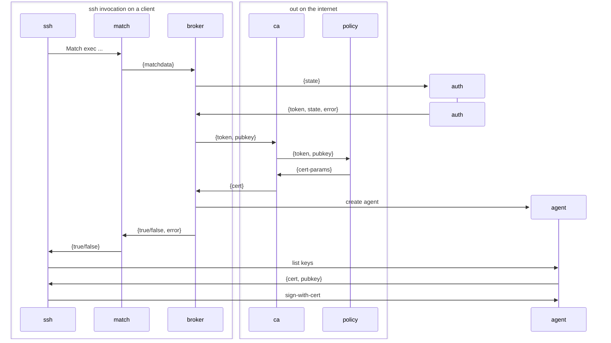

# Epithet makes SSH certificates easy

[](https://github.com/epithet-ssh/epithet/actions) [](https://goreportcard.com/report/github.com/epithet-ssh/epithet) [](https://codeclimate.com/github/brianm/epithet/maintainability)

## Plan for v2

The Epithet Agent is an ssh agent which runs on the endpoint. Rather than exposing a single agent socket, however, it will create a socket on demand for a given outbound connection.

To know if it needs to do it it will need to do something like:

```
Match exec "epithet auth --host %h --port %p --user %r --hash %C"
    IdentityAgent ~/.epithet/sockets/%C
```

The `epithet auth` invocation will do several things:

1. Check to see if the host (`%h`) should be handled by epithet at all, abort early if not
2. See if there is an existing, unexpired, certificate for the targeted user/host
3. If there is an existing cert, set up an identity socket at %C with only that cert
4. If there is not an existing cert, request one, including doing any need authentication, then if receive one, GOTO 3
5. When the certificate expires, delete the socket at %C

Step 5 is kind of questionable, but I think correct. In theory if a given cert if bound to a %C then it should be reusable directly as long as the socket/cert is there. Two catches -- this creates a race condition where it is unexpried when checked but before being used. This is a small window, so honestly is probably solvable by just having a 1-2 second "oh, this cert is going to expire, let's go fetch a new one" before allowing the connection. When the new one is established, just swizzle the cert into the agent on that socket and don't change the socket.

## Authentication

Epithet supports pluggable authentication via external auth plugins. The broker invokes these plugins to obtain tokens for certificate requests.

### Built-in OIDC/OAuth2 Authentication

Epithet includes built-in support for OIDC/OAuth2 authentication, compatible with:
- **Google Workspace**
- **Okta**
- **Azure AD / Microsoft Identity Platform**
- Any OIDC-compliant identity provider

**Example usage:**

```bash
epithet agent \
  --match '*.example.com' \
  --ca-url https://ca.example.com \
  --auth "epithet auth oidc \
    --issuer https://accounts.google.com \
    --client-id YOUR_CLIENT_ID.apps.googleusercontent.com"
```

**Features:**
- Authorization code flow with PKCE (no client secret needed)
- Automatic token refresh (no repeated browser logins)
- Dynamic port selection (works even when ports are occupied)
- Silent browser launch for authentication

**First connection:** Browser opens, user authenticates (~2-5 seconds)  
**Subsequent connections:** Fast token refresh (~100-200ms, no browser)

See [docs/oidc-setup.md](docs/oidc-setup.md) for detailed setup instructions and [examples/google-workspace/](examples/google-workspace/) for a complete example.

### Custom Auth Plugins

You can write custom auth plugins in any language following the simple protocol:
- **stdin**: State from previous invocation
- **stdout**: Authentication token
- **fd 3**: New state to persist
- **stderr**: Human-readable messages
- **Exit 0**: Success

See [docs/authentication.md](docs/authentication.md) for details.

## `epithet match` details

The `epithet match` invocation receives all the components of `%C` as well as the %C hash itself.
```
%C    Hash of %l%h%p%r%j.

%l    The local hostname, including the domain name.
%h    The remote hostname.
%p    The remote port.
%r    The remote username.
%j    The contents of the ProxyJump option, or the empty string if this option is unset.
```
The `%C` hash can be used as a key to find the specific agent for that "connection", which probably needs to be a map of `connection -> agent` where the agent exposes the ability to find the expiration of the cert it is currently using, the public key it is currently using, and the ability to atomically replace the cert it is using with a new one. The public key needs to be retrievable so that `epithet auth` can go get new certificates to recplace then in the agent in question.

Actually, interestingly, we might be able to use openssh's ssh-agent to do this, and not need to develop our own ssh-agent protocol at all. basically we set up a tree:

`epithet-agent` -> `[ssh-agent]` where it invokes ssh-agent commands on the agent as needed. We can optimize a number of things by keeping track of the certificates they are issued, so we can query the cert (and keys) without spawning a child process. Communication with the agent can be done via [ssh-agent-client-rs](https://github.com/nresare/ssh-agent-client-rs) which seems very fit for purpose.

We should consider destination constraining the target host for these agents. Need to think about abuse vectors if we don't do that.

## Notes


## Policy Server API

The policy server is a critical component of epithet that makes authorization decisions and determines certificate parameters. When a user requests an SSH certificate, the CA server forwards the request to your policy server to determine:

1. Whether to approve or deny the certificate request
2. What principals (usernames) to include in the certificate
3. How long the certificate should be valid
4. What SSH extensions to grant

### HTTP Endpoint

**Method:** `POST`
**Content-Type:** `application/json`

### Request Format

The CA sends a JSON request with the following fields:

```json
{
  "token": "authentication-token-from-user",
  "signature": "base64-encoded-signature",
  "connection": {
    "localHost": "user-laptop.local",
    "localUser": "alice",
    "remoteHost": "server.example.com",
    "remoteUser": "ubuntu",
    "port": 22,
    "proxyJump": "",
    "hash": "a1b2c3d4e5f6"
  }
}
```

**Fields:**
- `token` (string): The authentication token from the user (format determined by your auth plugin)
- `signature` (string): Base64-encoded cryptographic signature of the token, signed by the CA's private key
- `connection` (object): Full SSH connection parameters
  - `localHost` (string): User's local hostname (OpenSSH `%l`)
  - `localUser` (string): User's local username
  - `remoteHost` (string): Target SSH server hostname (OpenSSH `%h`)
  - `remoteUser` (string): Target username on remote server (OpenSSH `%r`)
  - `port` (uint): Target SSH port (OpenSSH `%p`)
  - `proxyJump` (string): ProxyJump configuration (OpenSSH `%j`), empty if not used
  - `hash` (string): OpenSSH `%C` hash - unique identifier for this connection

### Signature Verification

**IMPORTANT:** Your policy server must verify the signature before processing the request. This proves the request came from your CA server and not a malicious actor.

```go
import "github.com/epithet-ssh/epithet/pkg/ca"

// Verify signature (CA_PUBKEY is your CA's public key in authorized_keys format)
err := ca.Verify(CA_PUBKEY, token, signature)
if err != nil {
    // Invalid signature - reject the request
    http.Error(w, "invalid signature", http.StatusUnauthorized)
    return
}
```

### Response Format

**Success (HTTP 200):**

```json
{
  "certParams": {
    "identity": "alice@example.com",
    "principals": ["ubuntu", "root", "deploy"],
    "expiration": "5m0s",
    "extensions": {
      "permit-pty": "",
      "permit-agent-forwarding": "",
      "permit-port-forwarding": "",
      "permit-user-rc": "",
      "permit-X11-forwarding": ""
    }
  },
  "policy": {
    "hostPattern": "*.example.com"
  }
}
```

**Fields:**
- `certParams.identity` (string): Certificate identity/key ID (for audit logs)
- `certParams.principals` ([]string): List of usernames this cert can authenticate as
- `certParams.expiration` (string): Certificate validity duration (e.g., "5m", "10m", "1h")
- `certParams.extensions` (map[string]string): SSH certificate extensions to grant
  - `permit-pty`: Allow terminal allocation
  - `permit-agent-forwarding`: Allow SSH agent forwarding
  - `permit-port-forwarding`: Allow port forwarding
  - `permit-user-rc`: Allow executing `~/.ssh/rc`
  - `permit-X11-forwarding`: Allow X11 forwarding
- `policy.hostPattern` (string): Glob pattern for hosts this certificate is valid for (e.g., `*.example.com`, `server-*.prod.example.com`)

**Denial (HTTP 403 or 401):**

Return any non-200 status code to deny the certificate request. The status message will be logged.

### Policy Decision Logic

Your policy server should implement your organization's authorization logic:

```go
// Example: Check if user is allowed to access this host
func authorizeRequest(token string, conn policy.Connection) (*ca.PolicyResponse, error) {
    // 1. Validate the authentication token
    user, err := validateToken(token)
    if err != nil {
        return nil, fmt.Errorf("invalid token: %w", err)
    }

    // 2. Check authorization (your business logic here)
    if !canUserAccessHost(user, conn.RemoteHost, conn.RemoteUser) {
        return nil, fmt.Errorf("user %s not authorized for %s@%s",
            user, conn.RemoteUser, conn.RemoteHost)
    }

    // 3. Determine principals (which usernames to allow)
    principals := getPrincipalsForUser(user, conn.RemoteHost)

    // 4. Set expiration (shorter is more secure)
    expiration := 5 * time.Minute // Recommended: 2-10 minutes

    // 5. Grant appropriate extensions
    extensions := map[string]string{
        "permit-pty": "", // Usually safe to grant
    }

    // Add additional extensions based on use case
    if needsAgentForwarding(user, conn.RemoteHost) {
        extensions["permit-agent-forwarding"] = ""
    }

    return &ca.PolicyResponse{
        CertParams: ca.CertParams{
            Identity:   user.Email,
            Names:      principals,
            Expiration: expiration,
            Extensions: extensions,
        },
        Policy: policy.Policy{
            HostPattern: determineHostPattern(conn.RemoteHost),
        },
    }, nil
}
```

### OpenAPI Specification

A complete OpenAPI 3.0 specification is available at [`docs/policy-server-api.yaml`](docs/policy-server-api.yaml).

**Using the specification:**

1. **Generate server code** in your preferred language:
   ```bash
   # Using openapi-generator
   openapi-generator generate -i docs/policy-server-api.yaml -g python-flask -o policy-server
   openapi-generator generate -i docs/policy-server-api.yaml -g go-server -o policy-server
   openapi-generator generate -i docs/policy-server-api.yaml -g nodejs-express-server -o policy-server
   ```

2. **Import into AWS API Gateway:**
   - Open AWS API Gateway console
   - Choose "Create API" → "REST API"
   - Select "Import from OpenAPI"
   - Upload `docs/policy-server-api.yaml`
   - Configure Lambda backend or HTTP proxy to your policy logic

3. **Use with other API gateways:**
   - **Kong**: Use the OpenAPI plugin or generate Kong configuration
   - **Azure API Management**: Import OpenAPI spec directly
   - **Google Cloud Endpoints**: Deploy with gcloud using the spec
   - **Traefik**: Use with the OpenAPI middleware

4. **Validate requests/responses** using tools like Prism:
   ```bash
   # Mock server for testing
   npx @stoplight/prism-cli mock docs/policy-server-api.yaml
   
   # Validate your implementation
   npx @stoplight/prism-cli validate docs/policy-server-api.yaml
   ```

### Development Policy Server

For local testing and development, epithet includes a built-in policy server:

```bash
# Start the CA first
epithet ca --policy http://localhost:9999 --key /path/to/ca.key &

# Start a development policy server (allow-all mode)
# The policy server automatically fetches the CA's public key
epithet dev policy -p root -p admin --ca-pubkey http://localhost:8080 -P 9999 -v

# Start in deny-all mode to test error handling
epithet dev policy -p root --ca-pubkey http://localhost:8080 --mode deny-all -P 9999
```

See [Development Tools documentation](docs/development-tools.md) for complete usage details, including policy modes, configuration options, and testing scenarios.

### Security Considerations

1. **Always verify the signature** - This prevents unauthorized certificate issuance
2. **Use short expiration times** (2-10 minutes) - Limits damage from compromised certificates
3. **Grant minimal extensions** - Only grant what users need
4. **Log all decisions** - Track who accessed what for audit purposes
5. **Validate tokens thoroughly** - Ensure authentication tokens haven't been tampered with
6. **Use specific host patterns** - Avoid `*` in production; use `*.example.com` or more specific patterns

## TODO
