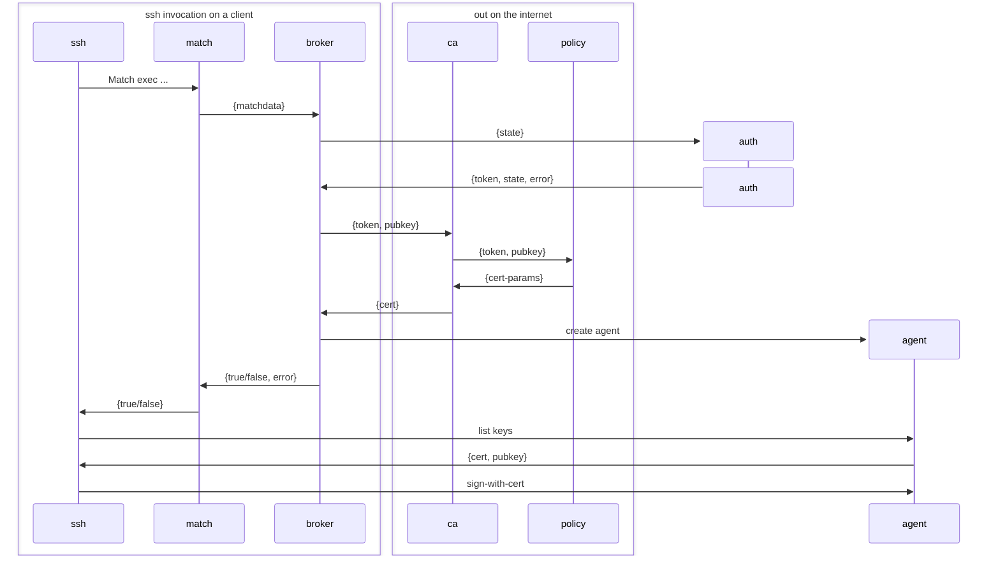

# Epithet makes SSH certificates easy

[](https://github.com/epithet-ssh/epithet/actions) [](https://goreportcard.com/report/github.com/epithet-ssh/epithet)

Epithet is an SSH certificate authority that replaces static authorized_keys with short-lived certificates (2-10 minutes). It creates on-demand SSH agents for each outbound connection, enabling real-time policy enforcement without touching your target hosts.

## Quick start

**1. Build epithet:**
```bash
git clone https://github.com/epithet-ssh/epithet.git
cd epithet
make build
```

**2. Start the agent:**
```bash
epithet agent \
  --ca-url https://your-ca.example.com \
  --auth "epithet auth oidc --issuer https://accounts.google.com --client-id YOUR_CLIENT_ID"
```

**3. Add to your SSH config** (`~/.ssh/config`):
```ssh_config
Include ~/.epithet/run/*/ssh-config.conf
```

**4. SSH as normal:**
```bash
ssh server.example.com
```

First connection opens your browser for authentication (~2-5 seconds). Subsequent connections use cached tokens (~100-200ms).

## How it works


```mermaid
sequenceDiagram
    box ssh invocation on a client
        participant ssh
        participant match
        participant broker
    end

    box out on the internet
        participant ca
        participant policy
    end

    ssh ->> match: Match exec ...
    match ->> broker: {matchdata}

    create participant auth
    broker ->> auth: {state}

    destroy auth
    auth ->> broker: {token, state, error}

    broker ->> ca: {token, pubkey}
    ca ->> policy: {token, pubkey}
    policy ->> ca: {cert-params}
    ca ->> broker: {cert}

    create participant agent
    broker ->> agent: create agent
    broker ->> match: {true/false, error}
    match ->> ssh: {true/false}
    ssh ->> agent: list keys
    agent ->> ssh: {cert, pubkey}
    ssh ->> agent: sign-with-cert
```

**Components:**

- **Broker** (`epithet agent`): Daemon managing authentication state and certificate lifecycle. Creates per-connection SSH agents.
- **CA Server** (`epithet ca`): Signs SSH certificates after validating tokens against a policy server.
- **Policy Server** (`epithet policy`): Makes authorization decisions - who can access what hosts as which users.
- **Per-connection Agents**: In-process SSH agents, one per unique connection, serving short-lived certificates.

## Commands

| Command | Description |
|---------|-------------|
| `epithet agent` | Start the broker daemon that manages certificates and agents |
| `epithet agent inspect` | Query a running broker's state |
| `epithet server` | Run the CA and policy server together |
| `epithet match` | Called by SSH Match exec to trigger certificate flow |
| `epithet ca` | Run the certificate authority server |
| `epithet policy` | Run the policy server with OIDC authorization |
| `epithet auth oidc` | Built-in OIDC/OAuth2 authentication plugin |

## Documentation

- [Architecture](docs/architecture.md) - How epithet works under the hood
- [Policy Server Guide](docs/policy-server.md) - Setup and configuration for the policy server
- [Authentication](docs/authentication.md) - Auth plugin protocol and custom plugins
- [OIDC Setup](docs/oidc-setup.md) - Provider-specific OIDC configuration (Google, Okta, Azure AD)

## Development

```bash
make build    # Build all binaries
make test     # Run tests
make clean    # Clean build artifacts
```

Requirements: Go 1.25+

## License

Apache 2.0
