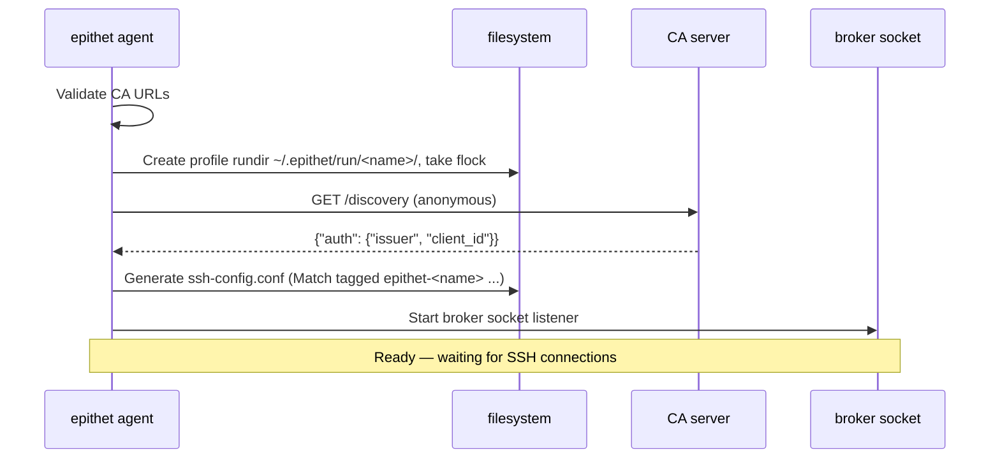

# Architecture

Epithet is an SSH certificate management tool that creates on-demand SSH agents for outbound connections. The core concept is to replace traditional SSH key-based authentication with certificate-based authentication using per-connection agents.

## Terminology

- **Broker**: The daemon process started by `epithet agent`. It manages OIDC authentication state, certificate lifecycle, and creates per-connection agent instances. The broker is the central coordinator for all epithet functionality on an endpoint. Each broker instance is a named **profile**: its rundir is `~/.epithet/run/<name>/` (default name `default`), containing its socket, agent sockets, and auto-generated SSH config.
- **Per-connection agents**: Individual in-process SSH agent instances (from `pkg/agent`), one per unique SSH connection (identified by the `%C` hash). Each serves a single certificate, minted fresh for that connection, via an agent socket at `~/.epithet/run/<name>/agent/%C`. Uses `golang.org/x/crypto/ssh/agent` for efficient in-process agent implementation (much lower overhead than spawning OpenSSH ssh-agent processes).
- **OIDC authentication**: The broker authenticates in-process via `pkg/auth/oidc`, an authorization-code-with-PKCE flow against the issuer and client ID it learns from the CA's discovery endpoint. There is no external auth command and no plugin protocol — see [authentication.md](authentication.md).

## Sequence diagrams

### Broker startup

What happens when you run `epithet agent`:



### Per-connection certificate flow

The full flow for each SSH connection:

```mermaid
sequenceDiagram
    box ssh invocation on a client
        participant ssh
        participant match
        participant broker
        participant oidc as OIDC provider
    end

    box out on the internet
        participant ca
        participant policy
    end

    ssh ->> match: Match tagged epithet-<name> exec ...
    match ->> broker: {"match": {connection...}}\n (JSON line, unix socket)

    alt no cached JWT valid for expiryBuffer
        broker ->> oidc: authorization code + PKCE (browser) or refresh
        oidc -->> broker: id_token (JWT)
    end

    broker ->> ca: POST / {"token", "connection"} — Authorization: Bearer <jwt>
    ca ->> policy: POST / {"token","connection"} — Authorization: Bearer <service JWT>
    policy ->> policy: verify user JWT (JWKS); verify service JWT (CA pubkey)
    policy ->> ca: {"certParams": {identity, principals, expiration, notAfter, extensions}}
    ca ->> broker: {"certificate"}

    create participant agent
    broker ->> agent: create agent with certificate
    broker ->> match: {"result": {"allow": true}}\n
    match ->> ssh: exit 0
    ssh ->> agent: list keys
    agent ->> ssh: {cert, pubkey}
    ssh ->> agent: sign-with-cert
```

## Match workflow

The `epithet match` workflow (`pkg/broker/broker.go:MatchWithUserOutput()`) is two steps past the fast path:

1. **Existing agent check**: If an agent socket already exists for this connection hash (`%C`) with an unexpired certificate (with a 5-second expiry buffer), allow immediately — no auth, no CA call.
2. **Fresh certificate mint**: Otherwise, generate an ephemeral keypair, get a JWT (from cache or via OIDC), request a certificate from the CA, and start a per-connection agent serving it.

Certificates are never cached or reused across connections — every mint past the fast path is a fresh policy decision naming exactly the requested principal. A background sweep deletes expired agent sockets every 30 seconds.

## Command structure

The `epithet` binary uses `alecthomas/kong` for command-line parsing with YAML config file support via `kong-yaml`. Config files use YAML or JSON format under `/etc/epithet/` or `~/.epithet/`.

### epithet match

```
epithet match --host %h --port %p --user %r --hash %C [--jump %j] --broker <path>
```

- Invoked by OpenSSH `Match tagged <tag> exec` during connection establishment (the generated per-profile config supplies the tag and broker path)
- Sends one JSON request line to the broker's unix socket and reads streamed events back
- Returns success/failure to OpenSSH to control whether connection proceeds

### epithet agent

```
epithet agent --ca-url <url> [--name <profile>] [--config <file>]
```

- Starts the broker daemon, listening on `~/.epithet/run/<name>/broker.sock`
- `--ca-url`: CA URL(s), repeatable for multi-CA failover. Optionally prefix with `priority=N:`; plain URLs default to priority 100. Higher-priority CAs are tried first; circuit breakers skip failed CAs.
- `--name`: profile name (default `default`); names the rundir and the ssh `Tag epithet-<name>`. A flock on the rundir prevents two agent processes from sharing the same profile.
- Fetches OIDC issuer/client ID from the CA's `/discovery` endpoint once at startup — no local auth configuration
- Auto-generates the SSH config file at `~/.epithet/run/<name>/ssh-config.conf`, gated by `Match tagged epithet-<name>`
- Maintains, under a mutex: the map of connection hash → per-connection agent instance, and one in-memory OIDC refresh token
- Creates in-process SSH agent instances for each unique connection
- Graceful shutdown with proper cleanup

### epithet ca

```
epithet ca --policy <url> --key <path> --listen <addr>
```

- Runs the CA server as a standalone HTTP service
- Listens on specified address (default `0.0.0.0:8080`)
- Reads CA private key from file
- `GET /` returns the CA's public key; `POST /` signs a certificate
- `GET /discovery` is an anonymous pass-through of the policy server's own discovery response
- The CA never validates the user's JWT itself — it forwards it to the policy server and signs whatever `CertParams` comes back

### epithet policy

```
epithet policy --ca-pubkey <key> --oidc-issuer <url> --oidc-client-id <id> --listen <addr>
```

- Runs the policy server: validates OIDC tokens and makes authorization decisions
- Config (users/hosts/defaults) is loaded once at startup; reload is a process restart
- See [policy-server.md](policy-server.md) for the full configuration and HTTP API

### epithet server

```
epithet server --listen <addr> --ca-key <path>
```

- Runs the CA and policy server as supervised subprocesses behind a single public port; the policy server listens on an internal unix socket the CA proxies to
- The CA/policy process boundary is otherwise deliberate — this mode is a convenience wrapper, not a merged implementation

## Core components

1. **CA Server** (`pkg/ca`, `pkg/caserver`, `cmd/epithet`): The certificate authority that signs SSH certificates. Accepts the user's token via `Authorization: Bearer` and passes it through unvalidated to the policy server, authenticating itself to the policy server with a short-lived, CA-minted service JWT (see [Protocols](#protocols) below). Signs public keys into certificates using the `CertParams` the policy server returns, clamping validity to `min(now + expiration, NotAfter)`.

2. **CA Client** (`pkg/caclient`): HTTP client library the broker uses to request certificates and fetch discovery from the CA. Sends the user's token in the `Authorization: Bearer` header. Includes domain-specific error types for different failure modes (`InvalidTokenError`, `PolicyDeniedError`, `ConnectionNotHandledError`, `CAUnavailableError`). Supports multi-CA failover with circuit breakers (`gobreaker`).

3. **Broker** (`pkg/broker`): The daemon process managing certificate lifecycle and OIDC authentication on endpoints. Communicates with `epithet match`/`epithet agent inspect` over newline-framed JSON on a unix socket — see [Protocols](#protocols). Implements per-connection agent creation and automatic expiry cleanup.

4. **Per-connection agents** (`pkg/agent`): In-process, read-only (`List`/`Sign` only) SSH agent implementation using `golang.org/x/crypto/ssh/agent`. One agent instance per unique connection, each exposing a unix socket at `~/.epithet/run/<name>/agent/%C`.

## Authentication mechanism

The broker authenticates in-process via OIDC (`pkg/auth/oidc`); there is no external auth command and no plugin protocol. See [authentication.md](authentication.md) for the full token contract, the proactive-refresh design, and the 401 safety net.

### Certificate lifecycle with short-lived certificates

**Key timing decision**: SSH certificates are **short-lived (2-10 minutes)**, and additionally clamped to never outlive the auth token that authorized them (`NotAfter`, derived from the token's `exp`) — see [policy-server.md](policy-server.md).

**Authentication vs certificate expiry:**
- **Auth sessions**: Long-lived (hours/days) via OIDC refresh tokens held in the broker's memory
- **SSH certificates**: Short-lived (2-10 minutes, further clamped to the token's remaining lifetime) for just-in-time authorization, minted fresh per connection
- **OIDC calls**: Proactive, ahead of JWT expiry, plus a single forced retry on a CA 401

**User experience:**
- First connection of the day: 2-5 seconds (browser auth flow)
- Subsequent connections (token still fresh or proactively refreshed): ~100-200ms
- After the refresh token expires: 2-5 seconds (full re-auth)

## Key data flow

1. User initiates SSH connection → OpenSSH `Match tagged` (via the user's own `Tag` lines) calls `epithet match`
2. Broker checks if an agent with an unexpired certificate already exists for this connection hash
3. If not: broker gets a JWT (cached, proactively refreshed, or freshly acquired via OIDC)
4. Broker generates an ephemeral keypair for this connection
5. Broker requests a certificate from the CA, sending the JWT and connection details
6. CA authenticates itself to the policy server with a service JWT and forwards the user's JWT and connection details unvalidated
7. Policy server validates the user's JWT (JWKS, issuer, audience, expiry), evaluates policy: "can this identity access this host as this exact requested user right now?"
8. Policy server returns `CertParams` — identity, principals (exactly the requested user), expiration, `NotAfter`, extensions
9. CA signs a certificate clamped to `min(now + expiration, NotAfter)` and returns it
10. Broker starts (or reuses) a per-connection agent socket serving this certificate
11. OpenSSH uses the certificate from the agent socket to establish the connection

## Important types and abstractions

- **`sshcert.RawPrivateKey`, `RawPublicKey`, `RawCertificate`**: Type-safe wrappers for SSH keys/certs in on-disk format (string-based)
- **`wire.CertParams`**: Policy response containing identity, principals, expiration, absolute `NotAfter`, and extensions for a certificate
- **`policy.Connection`**: Connection details (`%h`, `%p`, `%r`, `%C`, `%j`) passed through `match` → broker → CA → policy server
- **`agent.Credential`**: Private key + certificate pair used by the agent
- **`caclient.InvalidTokenError`, `PolicyDeniedError`, `ConnectionNotHandledError`, `CAUnavailableError`**: Domain-specific error types for CA failures

## Protocols

### Broker ↔ epithet match/inspect (local IPC)

Newline-framed JSON over the broker's unix socket — no gRPC, no protobuf. Both peers are the same binary, and the socket is 0700 in the profile rundir, so there is no cross-version or cross-language contract to protect.

- `epithet match` sends one line: `{"match": {"remoteHost":...,"remoteUser":...,"port":...,"proxyJump":...,"hash":...}}`. The broker streams zero or more `{"output": "<text>"}` events (auth progress, e.g. a device-code URL, written to the user's stderr) followed by exactly one `{"result": {"allow": bool, "error": "..."}}`.
- `epithet agent inspect` sends `{"inspect": {}}` and receives one `{"inspect": {...}}` response describing the broker's current agents and CA endpoint states.

### Broker → CA protocol

The broker requests certificates from the CA over HTTP with the user's JWT in `Authorization: Bearer`. `POST /` with `{"publicKey","connection"}` returns `{"certificate"}`.

**Error codes**: 401 (token rejected — triggers the single forced-refresh retry), 403 (policy denied), 422 (connection not handled by this CA), 5xx (CA unavailable, triggers failover).

### CA → policy server protocol

The CA authenticates to the policy server with a short-lived JWT it mints itself, signed with the CA's SSH private key (`pkg/serviceauth`), replacing the old RFC 9421 HTTP message signatures. Claims: `iss` (CA's SSH fingerprint), `aud: "epithet-policy"`, `iat`, `exp` (~60s), `jti`, `bh` (base64url-raw sha256 of the request body), `htm` (method), `htu` (host+path) — the last two bind the token to the exact request it was minted for, closing a same-body replay window body-hashing alone would leave open. The signing algorithm is derived from the CA key type (ed25519→EdDSA, RSA→PS256, ECDSA→ES256/ES384). The policy server verifies this service token on every request, in addition to validating the user's own JWT.

See [policy-server.md](policy-server.md) for the full HTTP API specification.

## Error handling and match behavior

These design decisions affect how epithet interacts with SSH's `Match exec` behavior.

### SSH config precedence

- SSH uses **first match wins** for configuration parameters
- `Match tagged` blocks are only evaluated for hosts the user tagged in their own `Host` blocks, evaluated in order
- When a `Match exec` returns non-zero, that Match block doesn't apply and SSH continues to the next Match or default config

### Match failure strategy

When epithet cannot obtain a certificate (auth failures, CA errors, agent creation failures):
1. **Log clear error to stderr** - user-friendly message explaining what went wrong
2. **Exit with non-zero status** - fail the Match so SSH falls through to next config
3. **Allow SSH fallback** - enables breakglass/escape hatch scenarios

**Rationale:**
- Enables breakglass accounts: users can have epithet `Match tagged` blocks first, then special-case configs with a specific `IdentityFile`
- If epithet fails the Match, SSH can try other auth methods (default keys, other agents)
- Users who need strict security can configure SSH with no fallbacks after epithet's blocks

**Multiple concurrent brokers**: Epithet supports multiple named profiles (work vs personal, different CAs). Each gets its own rundir, socket, and `Tag epithet-<name>`; the same `Include ~/.epithet/run/*/ssh-config.conf` line picks up all of them.

### CA error handling

**HTTP 401 Unauthorized** - token rejected:
1. Broker forces exactly one refresh via `Auth.ForceRefresh` and retries once
2. If the retry also fails, fail the Match with a clear error

**HTTP 403 Forbidden** - policy denied the request:
1. Fail the Match with a clear error explaining the denial; do not retry

**HTTP 422 Unprocessable Content** - this CA/policy server does not handle the connection:
1. Fail the Match; do not retry; SSH falls through to other auth methods

**HTTP 5xx Server Error** - transient CA/policy server issue:
1. Fail the Match; user can retry the SSH connection (or a different CA endpoint takes over via the circuit breaker)

### Certificate and agent management

Certificates are minted fresh per connection and are not stored independently of their agent: if agent creation fails after a successful mint, the certificate is simply discarded (a retry mints a new one). Agent creation failures are typically local (permissions, disk space, socket directory problems) and are surfaced as Match failures distinct from auth/policy denials.

## Configuration and SSH integration

When `epithet agent` starts, it auto-generates an SSH config at `~/.epithet/run/<name>/ssh-config.conf`, gated by `Match tagged epithet-<name>`. Tag the `Host` blocks it should handle in your own `~/.ssh/config`, then include the generated configs *after* those Tag lines:

```ssh_config
Host *.example.com
    Tag epithet-<name>
Include ~/.epithet/run/*/ssh-config.conf
```

`Tag`/`Match tagged` requires OpenSSH 9.4+ (macOS Sequoia and Ubuntu 24.04 both qualify).

Config files use YAML or JSON in `~/.epithet/`. Use `kebab-case` in config keys to match CLI flag names (e.g., `ca-pubkey` maps to `--ca-pubkey`). See `examples/` for complete examples.
