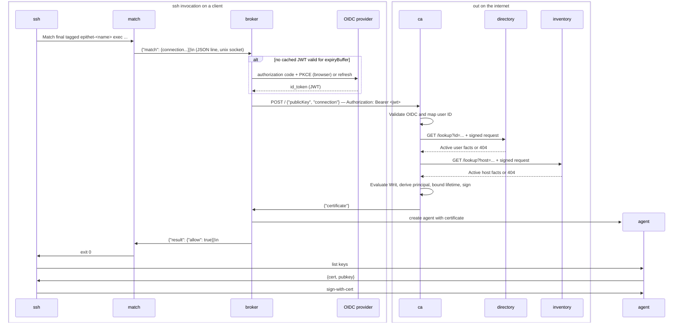

# Architecture

Epithet is an SSH certificate management tool that creates on-demand SSH agents for outbound connections. The core concept is to replace traditional SSH key-based authentication with certificate-based authentication using per-connection agents.

## Terminology

- **Broker**: The daemon process started by `epithet agent`. It manages OIDC authentication state, certificate lifecycle, and creates per-connection agent instances. The broker is the central coordinator for all epithet functionality on an endpoint. Each broker instance is a named **profile**: its rundir is `~/.epithet/run/<name>/` (default name `default`), containing its socket, agent sockets, and auto-generated SSH config.
- **Per-connection agents**: Individual in-process SSH agent instances (from `pkg/agent`), one per unique SSH connection (identified by the `%C` hash). Each serves a single certificate, minted fresh for that connection, via an agent socket at `~/.epithet/run/<name>/agent/%C`. Uses `golang.org/x/crypto/ssh/agent` for efficient in-process agent implementation (much lower overhead than spawning OpenSSH ssh-agent processes).
- **OIDC authentication**: The broker authenticates in-process via `pkg/auth/oidc`, an authorization-code-with-PKCE flow against the issuer and client ID it learns from the CA's discovery endpoint. There is no external auth command and no plugin protocol — see [authentication.md](authentication.md).

## Sequence diagrams

### Broker startup

What happens when you run `epithet agent`:

```mermaid
sequenceDiagram
    participant user as epithet agent
    participant fs as filesystem
    participant ca as CA server
    participant sock as broker socket

    user ->> user: Validate CA URLs
    user ->> fs: Create profile rundir ~/.epithet/run/<name>/, take flock
    user ->> ca: GET / (anonymous)
    ca -->> user: Link: <discovery>; rel="https://epithet.dev/rel/auth"
    user ->> ca: GET discovery (resolved from Link header)
    ca -->> user: {"auth": {"issuer", "client_id"}}
    user ->> fs: Generate ssh-config.conf (tagged IdentityAgent + final tagged exec)
    user ->> sock: Start broker socket listener
    Note over user,sock: Ready — waiting for SSH connections
```

### Per-connection certificate flow

The full flow for each SSH connection:


```mermaid
sequenceDiagram
    box ssh invocation on a client
        participant ssh
        participant match
        participant broker
        participant oidc as OIDC provider
    end

    box out on the internet
        participant ca
        participant directory
        participant inventory
    end

    ssh ->> match: Match final tagged epithet-<name> exec ...
    match ->> broker: {"match": {connection...}}\n (JSON line, unix socket)

    alt no cached JWT valid for expiryBuffer
        broker ->> oidc: authorization code + PKCE (browser) or refresh
        oidc -->> broker: id_token (JWT)
    end

    broker ->> ca: POST / {"publicKey", "connection"} — Authorization: Bearer <jwt>
    ca ->> ca: Validate OIDC and map user ID
    ca ->> directory: GET /lookup?id=... + signed request
    directory -->> ca: Active user facts or 404
    ca ->> inventory: GET /lookup?host=... + signed request
    inventory -->> ca: Active host facts or 404
    ca ->> ca: Evaluate Writ, derive principal, bound lifetime, sign
    ca ->> broker: {"certificate"}

    create participant agent
    broker ->> agent: create agent with certificate
    broker ->> match: {"result": {"allow": true}}\n
    match ->> ssh: exit 0
    ssh ->> agent: list keys
    agent ->> ssh: {cert, pubkey}
    ssh ->> agent: sign-with-cert
```

## Match workflow

The `epithet match` workflow (`pkg/broker/broker.go:MatchWithUserOutput()`) is two steps past the fast path:

1. **Existing agent check**: If an agent socket already exists for this connection hash (`%C`) with an unexpired certificate (with a 5-second expiry buffer), allow immediately — no auth, no CA call.
2. **Fresh certificate mint**: Otherwise, generate an ephemeral keypair, get a JWT (from cache or via OIDC), request a certificate from the CA, and start a per-connection agent serving it.

Certificates are never cached or reused across connections — every mint past the fast path is a fresh policy decision naming one principal for the requested account/host tuple. A background sweep deletes expired agent sockets every 30 seconds.

## Command structure

The `epithet` binary uses `alecthomas/kong` for command-line parsing. A flat TOML loader supplies defaults by exact long flag name. Default files are `/etc/epithet/*.toml` and `~/.epithet/*.toml`.

### epithet match

```
epithet match --host %h --port %p --user %r --hash %C [--jump %j] --broker-socket <path>
```

- Invoked by OpenSSH `Match final tagged <tag> exec` during connection establishment (the generated per-profile config supplies the tag and broker path). The final pass ensures `%h` and `%C` reflect OpenSSH hostname canonicalization before Epithet requests a certificate.
- Its six connection flags are CLI-only: configuration files are ignored for these values and no environment bindings are provided. Required flags must be supplied explicitly; omitted `--jump` stays empty. Global settings such as logging remain configurable.
- Sends one JSON request line to the broker's unix socket and reads streamed events back
- Returns success/failure to OpenSSH to control whether connection proceeds

### epithet agent

```
epithet agent --ca <url> [--agent-name <profile>] [--config <file>]
```

- Starts the broker daemon, listening on `~/.epithet/run/<name>/broker.sock`
- `--ca`: CA URL(s), repeatable for multi-CA failover. Optionally prefix with `priority=N:`; plain URLs default to priority 100. Higher-priority CAs are tried first; circuit breakers skip failed CAs.
- `--agent-name`: profile name (default `default`); names the rundir and the ssh `Tag epithet-<name>` (the default profile uses the bare `Tag epithet`). A flock on the rundir prevents two agent processes from sharing the same profile.
- `agent identity`, `agent login`, `agent logout`, `agent inspect`, and `agent kill` locate the running broker from this profile name; `--broker-socket` overrides the derived socket path.
- Fetches OIDC issuer/client ID from the CA's auth config once at startup (discovered via Link header on `GET /`) — no local auth configuration
- Auto-generates the SSH config file at `~/.epithet/run/<name>/ssh-config.conf`. A plain `Match tagged` block selects the per-connection `IdentityAgent` on whichever pass first supplies the tag; a separate `Match final tagged` block invokes Epithet after hostname canonicalization. `%C` is expanded from the final connection in both places.
- Maintains, under a mutex: the map of connection hash → per-connection agent instance, and one in-memory OIDC refresh token
- Creates in-process SSH agent instances for each unique connection
- `epithet agent inspect` defaults to one row per agent: a unique ID prefix, SSH-shaped connection, certificate serial, and time until expiry (or `expired`). ID prefixes start at four characters and grow as needed to distinguish current agents. `epithet agent inspect ID` accepts a full ID or any unique prefix and defaults to full details for that agent. The default depends on whether an ID is supplied, even when the list contains only one agent. Use `--expanded` for full broker and agent details, or `--compact` for one row per agent, including when selecting an ID. `--json` also supports selection; `--compact`, `--expanded`, and `--json` are mutually exclusive. Compact inspection of a selected agent displays the supplied ID prefix, validated against the complete agent set.
- `epithet agent kill AGENT_ID` accepts a full ID or unique prefix and evicts the identified agent and its in-memory credential; the next match for that connection generates a new keypair and requests a fresh certificate. This is local cache eviction, not certificate revocation, and does not disconnect established SSH sessions.
- Graceful shutdown with proper cleanup

### Server commands

- `epithet ca --directory URL --inventory URL --policy-file policy.writ --ca-key-file KEY`
  authenticates users, fetches facts, evaluates Writ locally, and signs certificates.
  `GET /` advertises auth discovery and control; `GET /discovery` serves local
  login configuration; `POST /` issues a certificate.
- `epithet control` authenticates and authorizes public administration, accepts
  SCIM provisioning and enrollment, and signs private backend requests.
- `epithet directory` serves user facts from static files or SCIM storage.
- `epithet inventory` serves host facts and owns enrollment storage.
- `epithet policy --check --policy-file policy.writ` validates policy offline.
- `epithet server --ca-key-file KEY --control-key-file KEY` supervises CA, control,
  directory, inventory, and a public router. All four services use private Unix
  sockets. Shared lifecycle is a deployment choice, not a shared process.
  The `router` command and its flags are hidden implementation details of
  `server`, which supplies their values when launching the subprocess.

See [deployment configuration](inventory.md) and [fact provider APIs](fact-services.md).

## Core components

1. **CA Server** (`pkg/ca`, `pkg/caserver`): Verifies the user's OIDC token,
   looks up directory and host facts over separately signed requests, evaluates
   Writ in-process, constructs one principal from the host's opaque domain and
   requested account, and signs. Expiry is bounded by signing-time TTL, login
   expiry, and any tighter policy deadline. Control owns administrative execution;
   fact backends own mutation invariants, storage, and audit.

2. **CA Client** (`pkg/caclient`): HTTP client library the broker uses to request certificates and fetch discovery from the CA. Sends the user's token in the `Authorization: Bearer` header. Includes domain-specific error types for different failure modes (`InvalidTokenError`, `PolicyDeniedError`, `PolicyPendingError`, `CAUnavailableError`). Supports multi-CA failover with circuit breakers (`gobreaker`).

3. **Broker** (`pkg/broker`): The daemon process managing certificate lifecycle and OIDC authentication on endpoints. Communicates with `epithet match` and `epithet agent identity`/`login`/`logout`/`inspect`/`kill` over newline-framed JSON on a unix socket — see [Protocols](#protocols). Implements per-connection agent creation and automatic expiry cleanup. Its agent map holds routing and expiry metadata, not copies of credentials.

4. **Per-connection agents** (`pkg/agent`): In-process, read-only (`List`/`Sign` only) SSH agent implementation using `golang.org/x/crypto/ssh/agent`. One agent instance per unique connection, each owning its private key and certificate and exposing a unix socket at `~/.epithet/run/<name>/agent/%C`.

## Authentication mechanism

The broker authenticates in-process via OIDC (`pkg/auth/oidc`); there is no external auth command and no plugin protocol. See [authentication.md](authentication.md) for the full token contract, the proactive-refresh design, and the 401 safety net.

### Certificate lifecycle with short-lived certificates

SSH certificates are short-lived and cannot outlive the login token that
actually authorized issuance. CA enforces that ceiling and any tighter Writ limit.

**Authentication vs certificate expiry:**
- **Auth sessions**: Long-lived (hours/days) via OIDC refresh tokens held in the broker's memory
- **SSH certificates**: Short-lived (2-10 minutes, bounded by Writ to the token's remaining lifetime) for just-in-time authorization. Each connection hash has its own agent and certificate; repeated matches reuse only that agent until expiry or explicit eviction.
- **OIDC calls**: Proactive, ahead of JWT expiry, plus a single forced retry on a CA 401

**User experience:**
- First connection of the day: 2-5 seconds (browser auth flow)
- Subsequent connections (token still fresh or proactively refreshed): ~100-200ms
- After the refresh token expires: 2-5 seconds (full re-auth)

## Key data flow

1. User initiates SSH connection → OpenSSH finishes hostname processing, including canonicalization when enabled, then `Match final tagged` (via the user's own `Tag` lines) calls `epithet match`
2. Broker checks if an agent with an unexpired certificate already exists for this connection hash
3. If not: broker gets a JWT (cached, proactively refreshed, or freshly acquired via OIDC)
4. Broker generates an ephemeral keypair for this connection
5. Broker requests a certificate from the CA, sending the JWT and connection details
6. CA validates OIDC and maps the directory ID, then fetches user and host facts independently.
7. Writ evaluates the normalized user attributes and all equivalent host names in the CA process.
8. Writ supplies TTL, extensions, an optional tighter deadline, and policy audit ID.
9. CA derives one principal, signs within the login and policy bounds, and returns the certificate.
10. Broker starts (or reuses) a per-connection agent socket serving this certificate
11. OpenSSH uses the certificate from the agent socket to establish the connection

## Important types and abstractions

- **`sshcert.RawPrivateKey`, `RawPublicKey`, `RawCertificate`**: Type-safe wrappers for SSH keys/certs in on-disk format (string-based)
- **`wire.PolicyFacts`**: Normalized authentication, requested target, user, and host resource, without inventory metadata
- **`wire.PolicyResponse`**: Policy-owned TTL, extensions, optional absolute deadline, and audit metadata
- **`ca.IssuedCertificate` / `ca.AuditMetadata`**: Signed certificate and private audit metadata returned by `CA.Issue`; authorization and signing inputs stay inside CA
- **`wire.Connection`**: Connection details (`%h`, `%p`, `%r`, `%C`, `%j`) passed through `match` → broker → CA → local Writ evaluation
- **`agent.Credential`**: Private key + certificate pair used by the agent
- **`caclient.InvalidTokenError`, `PolicyDeniedError`, `PolicyPendingError`, `CAUnavailableError`**: Domain-specific error types for CA failures

## Protocols

### Broker ↔ epithet match/agent commands (local IPC)

Newline-framed JSON over the broker's unix socket — no gRPC, no protobuf. Both peers are the same binary, and the socket is 0700 in the profile rundir, so there is no cross-version or cross-language contract to protect.

- `epithet match` sends one line: `{"match": {"remoteHost":...,"remoteUser":...,"port":...,"proxyJump":...,"hash":...}}`. The broker streams zero or more `{"output": "<text>"}` events (auth progress, e.g. the authorization URL to visit, written to the user's stderr) followed by exactly one `{"result": {"allow": bool, "error": "..."}}`.
- `epithet agent identity` sends `{"identity": {}}`. The broker authenticates through its shared token cache and streams login progress as `output` events, followed by `{"identity": {"identity": {"issuer": "...", "subject": "..."}}}` or an `identity.error`. It verifies the token using the agent's configured issuer and audience, and includes optional `oid`, `email`, and `email_verified` diagnostic claims. Identity mapping is owned by CA and control and is not advertised to the agent. Tokens stay inside the agent, and no certificate is requested.
- `epithet agent login` uses the identity request above, but prints only a login confirmation. It shares the broker's authentication cache and does not mint a certificate.
- `epithet agent logout` sends `{"logout": {}}` and receives `{"logout": {"agentsCleared": N}}` or a `logout.error`. The broker cancels the current login session, closes its certificate agents, and replaces both the ID token cache and the refresh-state fetcher. Requests from the canceled session cannot install agents afterward. The broker remains available for a fresh login.
- `epithet agent inspect` sends `{"inspect": {}}` and receives one `{"inspect": {...}}` response describing the broker's current agents (including each agent's host, user, port, ProxyJump, and `%C` hash) and CA endpoint states. An optional `id` in the inspect request selects one agent by full hash or unique prefix; missing and ambiguous IDs return an error.
- `epithet agent kill AGENT_ID` sends `{"kill": {"id":"..."}}` and receives one `{"kill": {"id":"...","connection":{...}}}` response. A failed lookup returns the same typed response with an `error` field.

### Broker → CA protocol

The broker requests certificates from the CA over HTTP with the user's JWT in `Authorization: Bearer`. `POST /` with `{"publicKey","connection"}` returns `{"certificate"}`.

**Error codes**: 401 (token rejected — triggers the single forced-refresh retry), 403 (policy denied), 202 (authorization pending), 5xx (CA unavailable, triggers failover).

### CA → fact services

CA sends signed single-key GET lookups to directory and inventory. Fact providers
never receive user OIDC credentials. A 200 response contains active facts, 404
means absent/inactive, and other failures are dependencies. Optional revisions
are bounded opaque log metadata, not cache or authorization tokens. All responses
are no-store. See the [provider contract](fact-services.md).

### Control → backends

Public admin requests require OIDC and a directory-backed role. Control signs
backend calls with its distinct key and binds the human ID in JWT `sub`. CA's
key permits reads only. SCIM retains a random public bearer validated at control;
backend audit labels remain `scim` and `host`. Inventory validates and consumes
enrollment credentials atomically with activation of the pending host. Directory
rebinding retains its transactional authorization-revision check.

## Error handling and match behavior

These design decisions affect how epithet interacts with SSH's `Match exec` behavior.

### SSH config precedence

- SSH uses **first match wins** for configuration parameters
- The plain `Match tagged` block selects `IdentityAgent` on either configuration pass; the `Match final tagged` block invokes Epithet only on OpenSSH's final pass. Tags selected from either the original hostname or the canonical hostname work.
- When a `Match exec` returns non-zero, that Match block doesn't apply and SSH continues to the next Match or default config

### Match failure strategy

When epithet cannot obtain a certificate (auth failures, CA errors, agent creation failures):
1. **Log clear error to stderr** - user-friendly message explaining what went wrong
2. **Exit with non-zero status** - fail the Match so SSH falls through to next config
3. **Allow SSH fallback** - enables breakglass/escape hatch scenarios through configured identity files or other authentication methods

**Rationale:**
- Enables breakglass accounts: users can have epithet `Match final tagged` blocks first, then special-case configs with a specific `IdentityFile`
- If epithet fails the Match, SSH can try identity files and other enabled authentication methods. Because the tagged block has already selected Epithet's per-connection `IdentityAgent`, it does not fall back to the ambient `SSH_AUTH_SOCK`; an explicit breakglass `IdentityFile` remains available.
- Users who need strict security can configure SSH with no fallbacks after epithet's blocks

**Multiple concurrent brokers**: Epithet supports multiple named profiles (work vs personal, different CAs). Each gets its own rundir, socket, and `Tag epithet-<name>`; the same `Include ~/.epithet/run/*/ssh-config.conf` line picks up all of them.

### CA error handling

See [the public CA error contract](ca-errors.md) for fixed messages and private
service status mapping. A rejected CA service credential is public 502; only
user-authentication rejection is public 401.

**HTTP 401 Unauthorized** - token rejected:
1. Broker forces exactly one refresh via `Auth.ForceRefresh` and retries once
2. If the retry also fails, fail the Match with a clear error

**HTTP 403 Forbidden** - policy denied the request:
1. Fail the Match with generic `access denied`; detailed reasons stay in server logs.

**HTTP 202 Accepted** - authorization is pending:
1. Fail the current Match with `authorization pending; try again later`.
2. Do not refresh authentication, fail over, or poll automatically; a later explicit attempt evaluates again.

**HTTP 5xx Server Error** - transient CA or fact-service issue:
1. Fail the Match; user can retry the SSH connection (or a different CA endpoint takes over via the circuit breaker)

### Certificate and agent management

Certificates are minted fresh per connection and are not stored independently of their agent: if agent creation fails after a successful mint, the certificate is simply discarded (a retry mints a new one). Agent creation failures are typically local (permissions, disk space, socket directory problems) and are surfaced as Match failures distinct from auth/policy denials.

## Configuration and SSH integration

When `epithet agent` starts, it auto-generates an SSH config at `~/.epithet/run/<name>/ssh-config.conf`. It selects `IdentityAgent` in a plain `Match tagged` block and invokes Epithet in a separate `Match final tagged` block. Tag the `Host` blocks it should handle in your own `~/.ssh/config`, then include the generated configs *after* those Tag lines:

```ssh_config
Host *.example.com
    Tag epithet-<name>
Include ~/.epithet/run/*/ssh-config.conf
```

`Tag`/`Match tagged` requires OpenSSH 9.4+ (macOS Sequoia and Ubuntu 24.04 both qualify).

Config files use flat TOML 1.1 with exact long flag names as top-level keys, without
command sections. Kong selects the command, looks up each flag's default, and
converts it to the flag's declared type. Keys that the selected command does not
look up have no effect. The loader does not maintain a separate config schema.

Precedence is explicit CLI, config, declared environment binding, then built-in
default. Default files load from `/etc/epithet/*.toml` and then `~/.epithet/*.toml`
in filename order within each directory. Later files replace earlier values for
the same key; explicit `--config FILE` adds the last file. Lists replace the whole
list rather than accumulating across files. Duplicate keys within a file are
TOML errors. YAML/JSON service configuration is no longer loaded; static directory
and inventory data files remain YAML.

List-valued flags use arrays even for one item. Maps use inline tables, which can
span multiple lines and allow trailing commas:

```toml
ca = ["https://ca.example.com/"]
agent-name = "work"
ca-timeout = "30s"
certificate-extension = {
  permit-pty = "",
  permit-port-forwarding = "",
}
```

`match`'s connection inputs are CLI-only and bypass config lookup. Its global
logging settings remain configurable. See `examples/` for deployment examples.

Flags with the same meaning use the same name across commands. Every service uses
`--listen`; separate configuration files can supply different listener addresses.
For `server`, `--listen` selects the public router address, while the launcher
supplies private Unix socket listeners to its children. Names are qualified where
an invocation needs to distinguish settings, such as CA and control signing keys.
Repeatable flags are singular, and `-file` denotes a file path. Endpoint flags
name the service or role without a `-url` suffix; help displays a `URL` placeholder
(including Unix socket URLs where supported). Public-key inputs omit
`-file` because they accept a literal SSH key, a file, or a URL.

The naming cleanup replaces these flags without compatibility aliases:

| Previous flag | Canonical flag |
| --- | --- |
| `ca --key`, `server --ca-key` | `--ca-key-file` |
| `control --key`, `server --control-key` | `--control-key-file` |
| `agent/host enroll --ca-url` | `--ca` |
| `ca/control --directory-url` | `--directory` |
| `ca --inventory-url` | `--inventory` |
| `ca --control-public-url` | `--control-public` |
| `control --directory-backend-url`, `--inventory-backend-url` | `--directory-backend`, `--inventory-backend` |
| `router --ca`, `--control` | `--ca-backend`, `--control-backend` |
| `directory --source`, `--directory-source` | `--directory-mode` (`static` or `scim`) |
| `inventory --inventory-source` | `--inventory-mode` (`static` or `enrollment`; replaces `managed`) |
| `directory/inventory --static` | `--directory-static-file`, `--inventory-static-file` respectively |
| `server --inventory` | Supply `--directory-static-file` and `--inventory-static-file` separately |
| `--ca-pubkey`, `--control-pubkey` | `--ca-public-key`, `--control-public-key` |
| `--extension`, `--default-expiration` | `--certificate-extension`, `--certificate-default-ttl` |
| Agent or management `--name` | `--agent-name` |
| `host enroll --name` | `--host-name` |
| `--broker` | `--broker-socket` |
| `--domain-file`, `--ca-pubkey-file` | `--principal-domain-file`, `--ca-public-key-file` |
| `--tls-ca-cert` | `--tls-ca-cert-file` |

Replace command-scoped YAML configuration with flat TOML keys using these spellings. Restart agents to regenerate
their SSH configuration. On enrolled hosts, rerun enrollment with the new binary to
regenerate the `AuthorizedPrincipalsCommand` flag spelling; existing state paths
and SSHD fragment metadata are unchanged.
