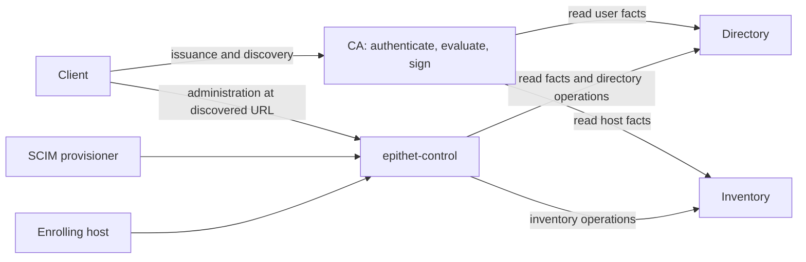

# Service topology and administrator authorization

Status: implemented in the working change, September 27, 2026. Tracking task:
`8rywbj6z`. This document records the agreed design; see [deployment and migration](inventory.md)
and the [fact provider contract](fact-services.md) for operator and implementer instructions.

## Agreed responsibilities

| Component | Owns | Authority toward fact services |
|---|---|---|
| CA | Issuance authentication, fact gathering, Writ evaluation, certificate signing | Read directory and inventory facts |
| `epithet-control` | Public administration, SCIM provisioning and host enrollment entry points; administrator authentication and role checks | Read facts and invoke administrative operations |
| Directory | User and group facts, directory mutation rules, concurrency checks, persistence and audit | Enforces the directory contract |
| Inventory | Host facts, inventory mutation rules, concurrency checks, persistence and audit | Enforces the inventory contract |

Control owns who may administer facts. The fact services own what constitutes a
valid change. Control calls their APIs; it does not open their storage directly.
Inventory does not acquire directory configuration or interpret user groups.

CA combines the issuance responsibilities in one process. Directory and inventory
remain independently replaceable fact providers. A custom LDAP directory or cloud
inventory adapter implements its small read contract; it need not implement
Epithet's built-in administration, SCIM, enrollment, or audit APIs. Control needs
read access to a custom directory to authorize administration of built-in inventory.

The earlier restriction that only CA may call fact services is superseded:
**CA reads for issuance; control reads and administers.**

## CA-to-facts API decisions

This contract is specifically CA -> directory/inventory. Control -> fact services
is a separate API design; its inspection and mutation requirements do not enlarge
the third-party issuance lookup contract.

Directory lookup uses the opaque authenticated `id`, with no required prefix or
provider-side OIDC claim mapping. It returns HTTP 200 with a user object for an
active user and HTTP 404 for an unknown or inactive user. There is no `active`
field or nullable success response. Caller authorization failures and provider
failures remain errors distinct from a missing user.

**Revision is optional logging metadata in both fact responses.** A provider may
return `revision` as an opaque string of at most 256 UTF-8 bytes. The CA logs it
as structured metadata alongside the lookup. Epithet does not interpret, compare,
order, or use it for caching or authorization. Omission is normal; Epithet does
not generate a substitute. A non-string or oversized value makes the provider
response invalid.

Providers need no global counter or snapshot-version semantics. Mandatory
source-revision requirements are removed; the optional value is retained for logging. This supersedes the earlier proposal to remove
revision metadata entirely.

This does not remove control-plane record revisions or the existing transactional
directory-rebinding check. Those protect mutations against concurrent changes
and belong to the separate administration contract.

**Host `accounts` is required.** Providers must explicitly return `null` for no
inventory account restriction, `[]` for no permitted accounts, or a list of the
permitted accounts. Omission is invalid, rather than implicitly unrestricted.
This makes the provider author choose the account-grounding behavior deliberately;
policy still decides whether to authorize an inventory-permitted account.

**Host `principal` is a required structured object with an explicit `mode`.**
`{"mode":"account-name"}` instructs the CA to use the requested account name
as the certificate principal. `{"mode":"epithet-principal-v1","domain":"opaque-value"}`
instructs the CA to derive the principal from the required opaque domain and
requested account. The domain is separate from host names and is not supplied
to Writ. Do not infer a mode from a null or missing domain; the proposed nullable
`principalDomain` alternative was not selected.

**User `userName` is optional; `id` remains required.** A missing username does
not match a `userName:` selector. Do not substitute `id` into `userName` for
policy evaluation. Display and audit output may use `id` when no username is
available, without inventing a username fact.

**User `groups`, `userType`, `department`, and `organization` are optional.**
Omitted `groups` means no group memberships. Omitted `userType`, `department`,
or `organization` means that attribute is absent; no value is inferred.
The minimal successful directory response is:

```json
{"id": "opaque-user-id"}
```

**Host `names` is required:** all equivalent host names, including the requested
name. Writ evaluates rules against all names. **Host `labels` is optional:**
omission means no labels. Inventory returns HTTP 404 for an unknown or inactive
host; a successful response always describes an active host.

**Lookups use GET with one query parameter and no request body.** On the
respective directory and inventory services:

```http
GET /lookup?id=opaque-user-id
GET /lookup?host=db.example.com
```

Use standard query-parameter encoding to preserve opaque IDs. These are single-key
lookups, not filtering or compound queries. GET was selected for straightforward
implementation in third-party frameworks.

**Lookup responses must include `Cache-Control: no-store`, including 404s.**
The CA performs fresh lookups and does not maintain an application fact cache.
The request signature must cover the query string as well as the method and
host/path, so a signed lookup cannot be reused for a different lookup key. The
current service signer excludes the query string and must be extended.

The directory and host response shapes and lookup encoding are agreed. The
concrete authentication contract remains to be finalized within the service trust
boundaries below.

## Deployment and discovery

`epithet-control` is always a separate service process. The combined `epithet server`
launcher starts CA, control, directory and inventory, with the public router.
Separately managed deployments run control explicitly as well. There is one
control implementation and one process boundary in both arrangements.

The combined launcher is a convenience for small, simple deployments. Its shared
lifecycle is an intentional deployment choice; this design does not require
changing it into an independently restarting supervisor. Operators who need
independent service lifecycles supervise the services separately.

Clients configure the CA address and discover control through a CA `Link` header.
In a combined deployment, the public router sends administration, SCIM and
enrollment traffic to control, and issuance traffic to CA. Control can share the
public origin with CA without administration passing through the CA process.
Separate deployments advertise the independently deployed control URL. Directory
and inventory service APIs remain private.



The diagram shows logical destinations; the combined public router is omitted.
CA discovery supplies the control URL to Epithet clients. This does not imply
that a SCIM provider implements Epithet discovery.

Process separation keeps administration execution outside CA's process. It does
not eliminate shared-host resource contention or fact-store contention. Initial
client discovery still depends on CA; no independent recovery/bootstrap workflow
has been agreed.

## Human administration

Control validates the administrator's OIDC credential, maps the identity using
the same identity semantics as issuance, and obtains the actor's directory facts.
An active directory user is required, including for explicit user-ID grants.

There are two independently assignable roles, configured in control:

- Directory administrator, granted through configured user IDs or directory groups.
- Inventory administrator, granted through configured user IDs or directory groups.

The same user or group may hold both. Fact services do not repeat these role
checks or maintain their own administrative group configuration. They authenticate
control's authority, enforce operation invariants, and record the actor in audit.

For a human mutation, the flow is:

1. Client discovers control and sends its authenticated request there.
2. Control validates identity, looks up current directory facts and checks the
   role for the requested administrative domain.
3. Control signs the backend request, including the authenticated actor.
4. The backend verifies the request and the signer's authority, validates the
   mutation and relevant revisions, and persists it with its audit record.

Directory alias rebinding must retain its existing transactional check of the
directory revision used for authorization. Control must carry that revision in
authenticated request data. Inventory currently has a lookup-to-write race with
directory changes; this split must not claim a cross-service atomic authorization
snapshot. The freshness contract is identified below for explicit agreement.

## Service trust and signed requests

Control has its own persistent signing key pair. Its private key is configured;
fact services receive its public key out of band. They do not receive control's
private key or the SSH CA private key. Automatic key provisioning was not selected.

| Caller credential | Permitted use |
|---|---|
| CA signing key | Fact reads for issuance; no administrative authority |
| Control signing key | Fact reads and authorized backend administration |
| Human OIDC credential | Authentication to control, followed by directory-backed role checks |
| SCIM provisioning credential | SCIM provisioning only; no human administrator role |
| Enrollment credential or pending-enrollment flow | Existing enrollment semantics; no human administrator role |

SCIM keeps its existing operator-supplied random bearer token. The topology
refactor does not replace that external credential with OIDC or a client JWT.

A recognized signature alone does not grant every permission. The backend must
distinguish the trusted CA reader from the trusted control administrator.

For human administration, control mints a short-lived JWT with the authenticated
actor as `sub`. The signature also covers the destination service, HTTP method,
request target and body hash, extending the existing request-bound service JWTs.
The receiving fact service records the actor. The operation is already identified
by the HTTP request, including its body; no separate operation claim is needed.

The signing identity and the actor are different: control is the trusted signer;
`sub` identifies the human whose request control authorized. Client-supplied actor
metadata cannot replace control's authenticated attribution.

Service tokens retain their 60-second lifetime and now bind the full query
as well as host, escaped path, method, and body. Human administration includes
the signed actor claim. No single-use replay database is introduced.

## Contract decisions

### 1. Where do provisioning and enrollment credentials get checked?

Both flows enter through control. SCIM's random bearer is validated at control;
inventory validates and consumes enrollment credentials atomically with the host
transition. Backend audit retains `scim` and `host` for these machine operations.


**Agreed:** control validates the existing random SCIM bearer token and signs
its downstream request to directory.

**Agreed:** inventory owns enrollment credential creation, validation, and
consumption. Creating a token creates a pending host without attributes;
redemption fills in the attributes and atomically activates the same host record.
A pending status alone never authorizes enrollment or certificate issuance.
Control authorizes administrator requests and forwards enrollment; it does not
own token state. Existing token API operations remain available.

Port the existing control-plane APIs and workflows to the new control service;
defer API cleanup to the next revision. Preserve the current non-human audit
attribution (`scim` for provisioning and `host` for enrollment), without treating
those labels as authenticated human identities.

### 2. Freshness and replay: preserve existing semantics (agreed)

Look up the human actor's directory facts for
each administrative request, mint a token for that request, retain the current
short lifetime, and preserve the directory-rebinding revision check. Explicitly
accept the existing inventory lookup-to-write race. This avoids introducing a
cross-service transaction or revocation protocol.

No freshness or replay behavior changes are included in this refactor. Keep the
60-second service-token lifetime and existing operation/revision checks. Request
binding prevents reuse for a different bound request; it does not make the same
request single-use. No replay store or new revocation mechanism is proposed.
The required extensions are control's distinct authority and authenticated actor
attribution, already agreed above.

Target binding includes the exact escaped path and raw query string. The client
uses standard query encoding; proxies must preserve that signed target.

### 3. Enumeration: refactor first, optimize second (agreed)

The earlier options analysis found that directory enumeration reads all user
facts through one SQLite connection and inventory enumeration clones and sorts
all records under its read lock. Control's separate process does not solve those
backend costs. No load-test result is claimed.

Preserve current listing behavior in this refactor. Pagination and enumeration
optimization come afterward; they are not prerequisites for the service split.
This refactor makes no new backend load-isolation performance promise.

Existing task `mxqw1xmw` covers directory users/groups storage pagination. It does
not yet cover the full administrative `ListUserFacts` projection or inventory
listing. Scope those additions when taking up optimization; this refactor does
not expand that task or add it as a dependency.

## Routine implementation choices and scope boundaries

CLI names, configuration keys, and migration are documented in inventory.md.
Server configuration remains separate from management-client agent profiles and
sockets. Public control-plane operations retain their existing shapes.

This agreement does not add CA proxy modes, in-process control, mTLS, automatic
key generation, independent outage bootstrap, new OIDC token kinds or application
registrations, workload credentials, or compatibility shims. Any need for those
would be a separate behavior discussion. Richer group-management UX remains in
`1c682zm5`.

## Why this topology was selected

The September 19 exploration compared materially different ownership models:

| Option | Benefit | Cost or reason it was not selected |
|---|---|---|
| A: inventory consults directory | Fewer services; narrow one-way dependency | Inventory owns user authorization and directory configuration |
| B: administration inside CA | Fewer processes and signing identities | Administrative execution and payloads share the issuing process |
| C: separate control service (selected) | Central role checks; focused fact providers; separate administration process | Another privileged service, signing key and private management contract |
| D: combined directory/inventory provider | Simpler all-built-in deployment | Built-in inventory with a custom directory still needs an authorization solution |
| E: IdP claims or explicit grants without directory | No directory authorization lookup | Changes directory-backed deactivation and group semantics |
| F: client carries an authorization assertion | Management payloads bypass the authorizer | Adds a client exchange and delegated-authority protocol not requested |
| G: backend asks CA to authorize | Large management responses bypass CA | Reverse backend-to-CA dependency and administration authority in CA |

The selected control JWT is a service-to-service request credential. It does not
introduce option F's client-carried delegation flow. The public router and CA's
Link preserve the simple client configuration without either hosting control in
CA or adding an optional CA proxy mode.

## Validation

- Exercise issuance and administration through both the combined launcher and
  independently deployed services, keeping control separate in both.
- Test all-built-in and mixed custom-directory/built-in-inventory and
  built-in-directory/custom-inventory deployments using minimal read adapters.
- Verify active-user requirements, explicit ID and group grants, role separation,
  deactivation and group removal, and directory-rebinding revision conflicts.
- Reject CA-reader credentials at administrative endpoints, untrusted actor
  attribution, and requests with incorrect destination, method, target or body.
  Exercise expiry and the replay behavior selected above.
- Exercise SCIM provisioning and enrollment through control, including invalid
  credentials, token consumption, pending admission and backend-owned audits.
- Verify discovery and routing, plus the existing combined shared lifecycle and
  separately supervised process behavior. Do not claim fresh-client recovery
  during a CA outage or backend load isolation without a separate agreed contract.
- Run `make build` and `make test`; run `go test -race ./pkg/broker` if broker
  concurrency paths change. This document does not claim those future behaviors
  have been implemented or tested.

## Source references

These references anchor the existing behavior described above:

- [Current authorization and management dispatch](../pkg/controlplane/server.go)
- [Service JWT signing and verification](../pkg/serviceauth/serviceauth.go)
- [SCIM credential validation and adapter](../pkg/directory/scim/http.go)
- [Directory storage, revisions and audit](../pkg/directory/sqlitestore/store.go)
- [Enrollment, host storage and audit](../pkg/inventory/managed.go)
- [Combined launcher](../cmd/epithet/server.go) and [public router](../cmd/epithet/router.go)
- [Client discovery](../pkg/caclient/inventory.go)
